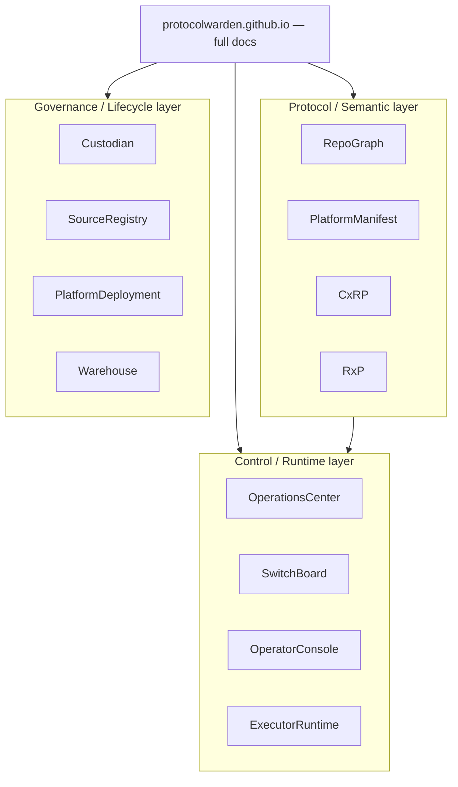

# ProtocolWarden

Contract-first AI operations ecosystem built around semantic repo graphs,
execution protocols, policy-controlled routing, and public-safe architecture
projection.

## What to click next

- Full documentation: **[protocolwarden.github.io](https://protocolwarden.github.io/)**
- Repo catalog: [protocolwarden.github.io/repos/](https://protocolwarden.github.io/repos/)
- Architecture charter: [protocolwarden.github.io/architecture/](https://protocolwarden.github.io/architecture/)
- Governance: [protocolwarden.github.io/governance/](https://protocolwarden.github.io/governance/)

## Ecosystem at a glance

## Protocol / Semantic layer

| Repo | Role |
| --- | --- |
| [RepoGraph](https://github.com/ProtocolWarden/RepoGraph) | shared graph semantics, schema governance, boundary artifact language |
| [PlatformManifest](https://github.com/ProtocolWarden/PlatformManifest) | public-safe repo graph projection publisher |
| [CxRP](https://github.com/ProtocolWarden/CxRP) | contract execution routing protocol — schemas and vocabulary |
| [RxP](https://github.com/ProtocolWarden/RxP) | runtime execution protocol — invocation and result contracts |

## Control / Runtime layer

| Repo | Role |
| --- | --- |
| [OperationsCenter](https://github.com/ProtocolWarden/OperationsCenter) | planning, routing, execution dispatch, policy, evidence, run artifacts |
| [SwitchBoard](https://github.com/ProtocolWarden/SwitchBoard) | policy-driven execution-lane and backend selector |
| [OperatorConsole](https://github.com/ProtocolWarden/OperatorConsole) | operator entrypoint — persistent workspaces, context continuity, delegation |
| [ExecutorRuntime](https://github.com/ProtocolWarden/ExecutorRuntime) | runtime invocation mechanics consuming RxP contracts |

## Governance / Lifecycle layer

| Repo | Role |
| --- | --- |
| [Custodian](https://github.com/ProtocolWarden/Custodian) | cross-repo boundary, drift, and audit enforcement |
| [SourceRegistry](https://github.com/ProtocolWarden/SourceRegistry) | source and fork tracking and lifecycle |
| [PlatformDeployment](https://github.com/ProtocolWarden/PlatformDeployment) | local developer platform for the shared AI coding stack |
| [Warehouse](https://github.com/ProtocolWarden/Warehouse) | LLM-ready context packaging and staging |

## External integrations

Backend candidates and forked dependencies are documented separately so they
are not confused with core platform repos. See
[protocolwarden.github.io/repos/external-integrations/](https://protocolwarden.github.io/repos/external-integrations/).

## Public surface

| Repo | Purpose |
| --- | --- |
| [ProtocolWarden/ProtocolWarden](https://github.com/ProtocolWarden/ProtocolWarden) | this repo — GitHub profile front door |
| [ProtocolWarden/ProtocolWarden.github.io](https://github.com/ProtocolWarden/ProtocolWarden.github.io) | full documentation site |
